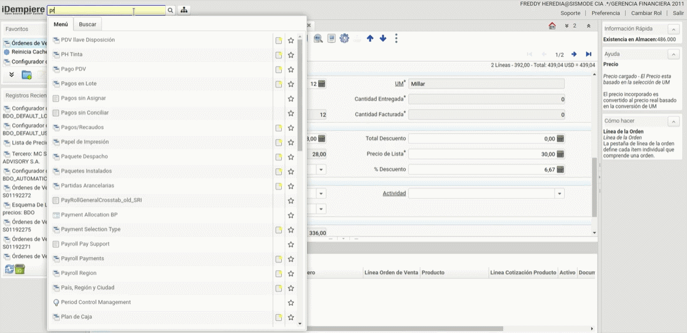
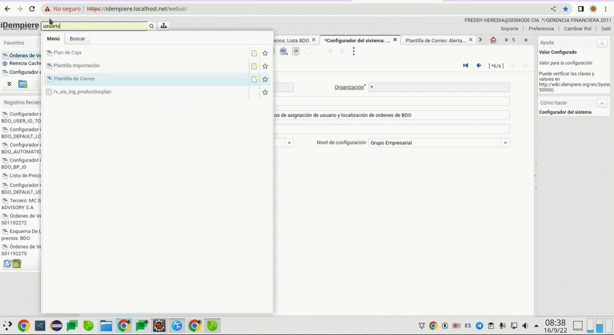
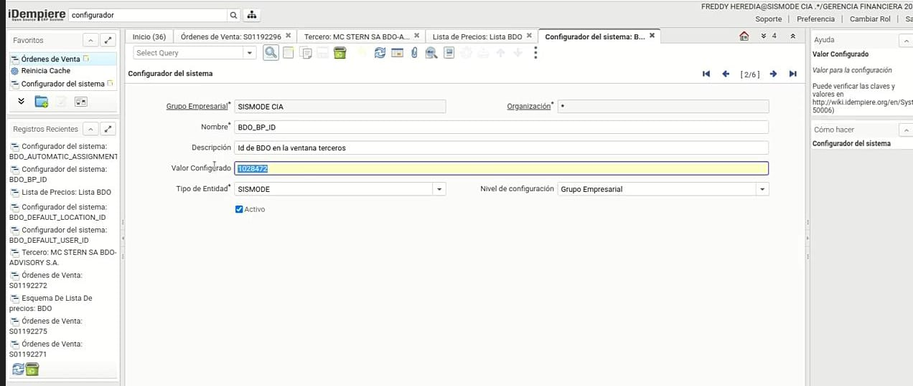
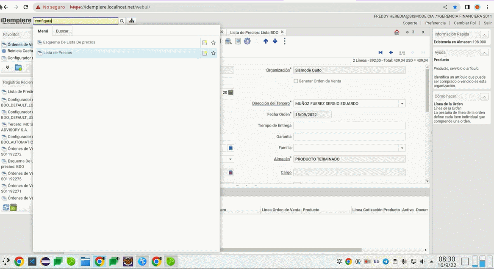
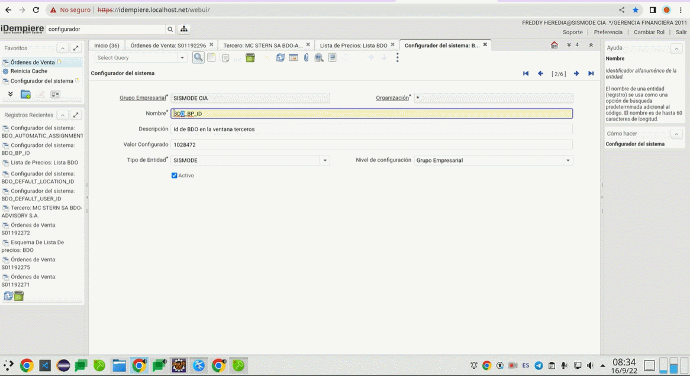
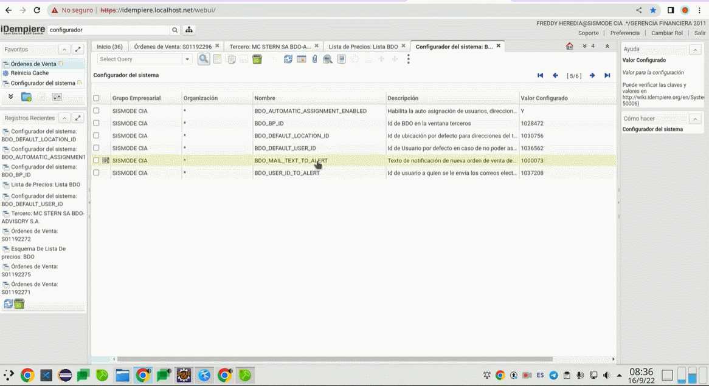

# DESARROLLO

Asigna la dirección y el usuario envase al RUC que desde el encabezado de la orden y respectivamente busca en la localización y en el contacto.

## **Autoasignación de usuario, localización y precios para una orden de venta**

Las ordenes de venta provienen de un sistema externo al ERP de Sismode, en este caso son enviadas a traves de una empresa llamada bdo advirso
hacia el ERP de IDEMPIERE.

## _**Características**_

- **El tercero** es con quién se realiza transacciones, este puede incluir proveedores, clientes, empleados o vendedores.
- **La orden** define los parámetros.

- **Localización** define la localización físcia de un tecero ya que puede tener registros múltiples de la localización.
- **ISDN** identifica un número de línea Módem.

- **Contácto (*usuario*)** identifica a un usuario único en el sistema, esto puede ser un usuario interno o un contacto del tercero.
- **Línea de orden** define cada item individual que comprende una orden.
- **Producto** puede ser comprado o vendido.

## _**Configuración de lista de precios**_

> En la lista de precios se pueden manejar varias listas en donde se determina la moneda del documento así como el tratamiento de impuestos.

 Hay varias formas de crear un listado de precios, a continuación se le explica la primera:
 
 Siga los siguientes pasos:
 
  1. Digite la palabra __*lista de precio*__ en el menú de búsqueda principal.
  
  2. En el campo __*Nombre*__ coloque el número de RUC de la empresa a la que se desea configurar los precios.

  
  
  3. En el __*Esquema lista de precios*__ seleccione *BDO*.
  
  4. Coloque la fecha en la que va a comenzar la configuración.

  
  
  5. Ingrese a la sección de productos.

  

>Las ordenes de venta que vengan con terceros van a tener una dirección diferente, hay un campo RUC en donde se colocara y el sistema buscara en base al RUC cual es la entrega y su contacto correcto en cambio BDO buscará la version que tenga ese RUC.
  
## _**Configuraciones**_

Configurador del Sistema :
En esta se podrá cambiar los valores que están configurados actualmente un ejemplo sería : a qué usuario se le va a enviar el correo , cuál es la localización o el usuario por defecto; esto sería en el caso si en un futuro varie el ID de BDO lo podemos cambiar .

También si se habilita o deshabilita el desarrollo para que no funcione .

Para realizar dicha configuración, se realiza los siguientes pasos:

1. Digite la palabra __*configuración*__ en el menú de búsqueda principal.

2. En el campo __*Nombre*__ coloque la palabra *BDO*.

3. Configuración del sistema si desea parar el programa ponga N y si desea continuar ponga Y.

4. Ventana de terceros.

5. Ubicación de direcciones.

6. ID usuario por defecto en caso de no asociar contacto con el RUC.

7. Texto de notificaciones de la nueva orden.

  
  