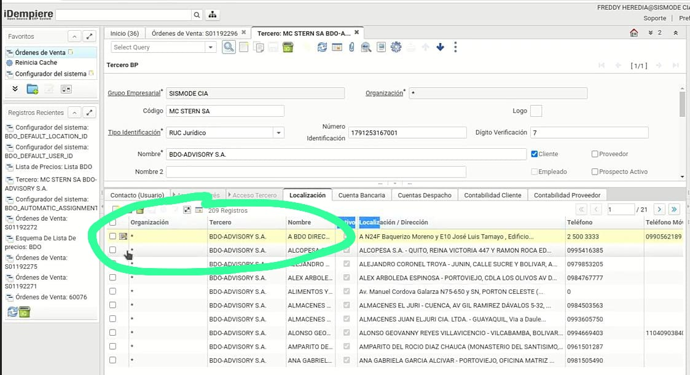
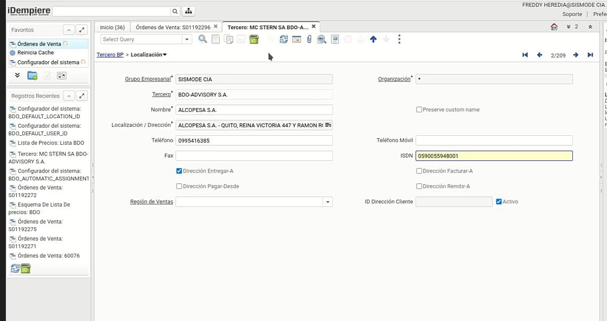

 ## _**Configuración del RUC dentro de la localización en el campo ISDN**_

1. Ingrese al tercero BDO.
2. Baje a la pestaña de localización.

3. Cree un registro y coloque los datos deseados del nombre de la localización.
4. En el campo ISDN asegurese de colocar el RUC del tercero.

