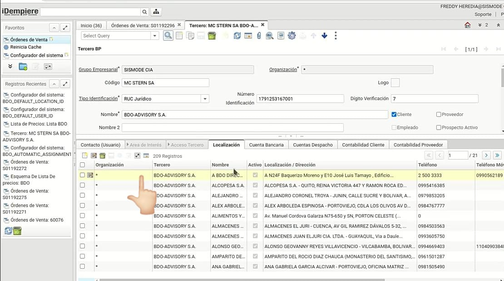
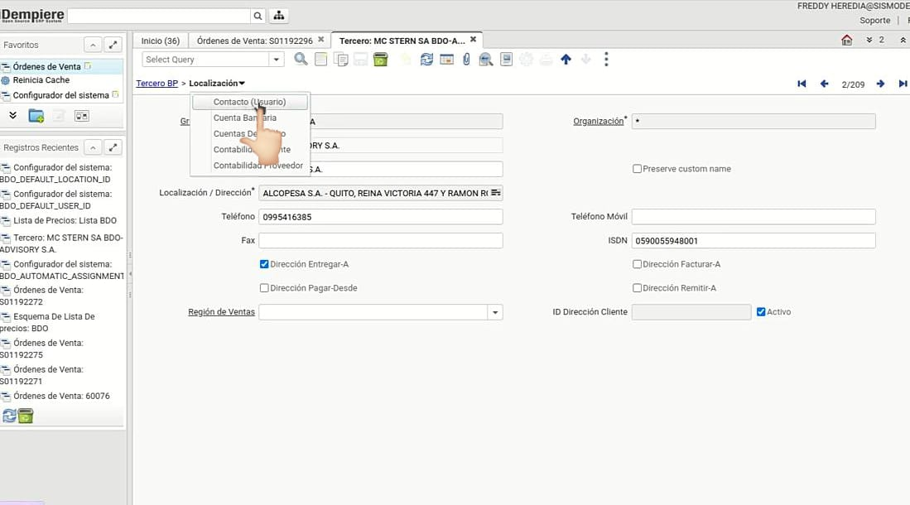
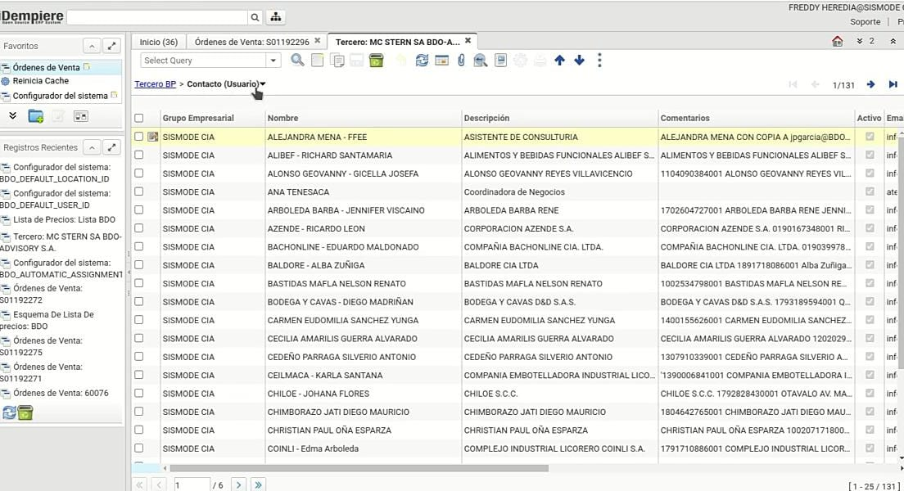
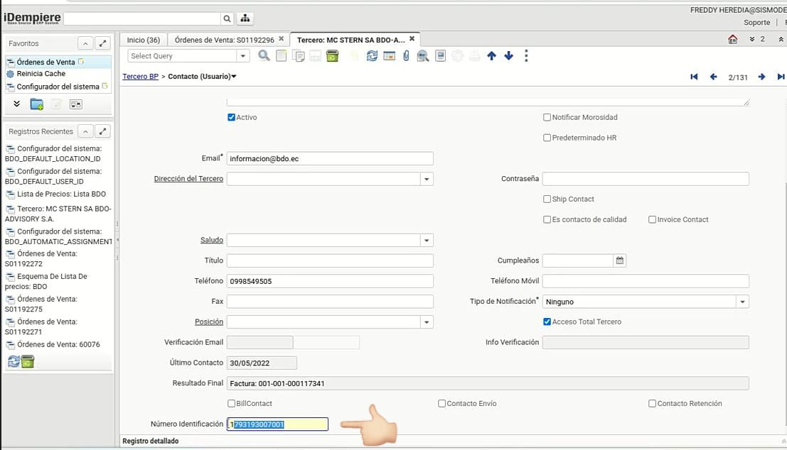

## *Configuración del Usuario*

 1. Ingrese al tercero BDO.

 

 2. Descienda la pestaña usuario.

 

 

 3. Registre el nombre del contacto y en el campo número de identificación asegure de colocar el RUC del tercero de la empresa relacionada.

