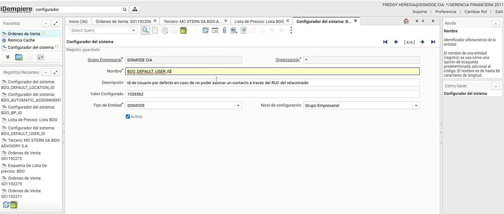

## *Configuradores del Sistema*

Dentro de está ventana se puede cambiar valores que esten actualmente configurados un claro ejemplo sería a qué usuario se le va a enviar el correo, cuál es la localización
o el usuario por defecto, esto sería en el caso de que un futuro varie el ID de BDO y de está manera lo podrían cambiar.

### *Habilitar o deshabilitar el desarrollo actual*

Configuraciones actuales de este desarrollo:

1. BDO_AUTOMATIC_ASSIGNMENT_ENABLED:
Habilita la autoasignación de usuarios, direcciones y precios para las ordenes de venta de BDO.

2. BDO_BP_ID: 
id_BDO en la ventana de terceros en caso de que varie el ID del BDO se puede actualizar.

3. BDO_DEFAULT_LOCATION_ID: 
El id de ubicación por defecto para direcciones del tercero relacionado de BDO (en caso de no encontrar la correcta).

4. BDO_DEFAULT_USER_ID: 
El id de usuario por defecto de caso de no poder asociar un contacto a través del RUC del relacionado.

5. BDO_MAIL_TEXT_TO_ALERT: 
El texto de notificación de nueva orden de venta de BDO.

6. BDO_USER_ID_TO_ALERT: 
El id del usuario a quien se le envía los correos electrónicos de asignación de usuario y localización de ordenes BDO.

