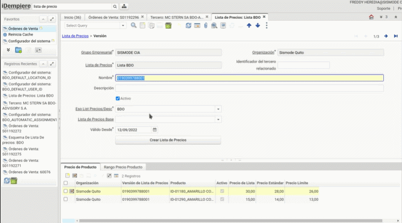
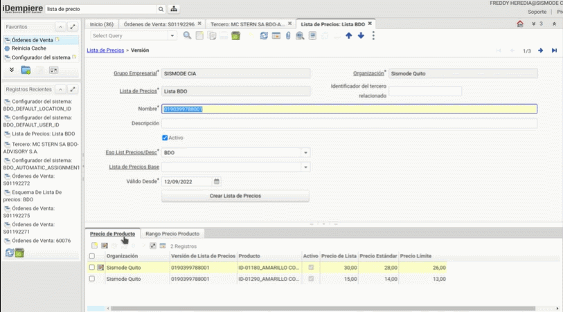

# Configuraciones necesarias para este desarrollo

## _**Primera Configuración**_

 En la lista de precios se pueden manejar varias listas en donde se determina la moneda del documento así como el tratamiento de impuestos.

 Hay varias formas de crear un listado de precios, a continuación se le explica la primera:
 
 Siga los siguientes pasos:
 
  1. Digite la palabra __*lista de precio*__ en el menú de búsqueda principal.
  2. Ubique la lista de precios BDO, en caso de no existir cree la lista de precios de BDO.

  

  3. Descienda a la versión de lista de precio.
  4. Cree un nuevo registro y en el campo nombre coloque el RUC de la emepresa a la que desea configurar el precio. 

  

  5. En el __*Esquema lista de precios*__ seleccione *BDO* (en caso de no encontrarlo creelo). 

  6. Asegurese de colocar una fecha que no este repetida, a fin de que el sistema le deje guardar los cambios deseados (las fechas deben ser anteriores a la actual). 
  7. Baje a la pestaña de productos. 

  

  8. Digite el precio de productos.
  9. Digite el precio de lista.

 10. Digite el precio estándar
11. Digite el precio lÍmite.

   

 